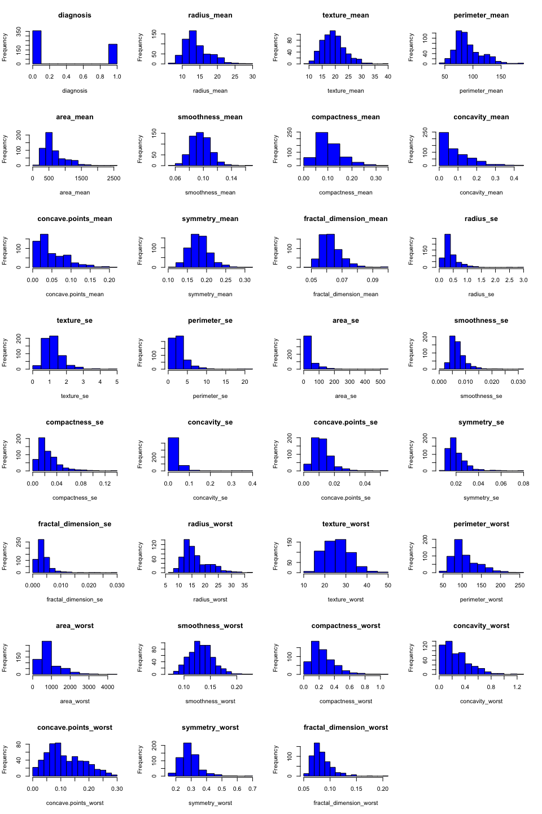
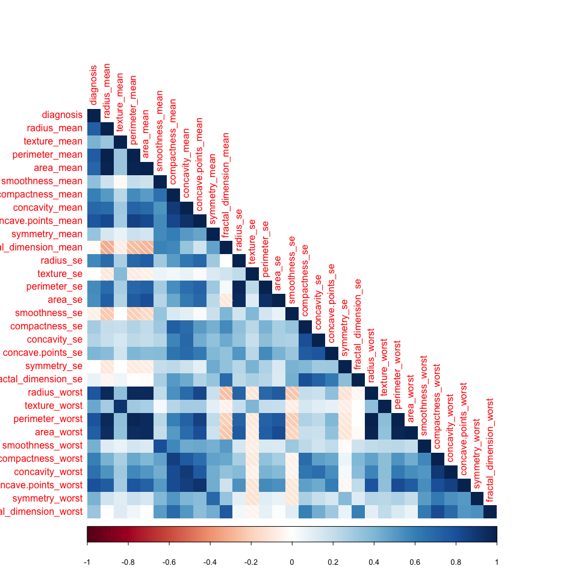

# Breast Cancer Detection: Exploratory Analysis & Data Cleaning
Robert Smith  
8/9/2017  
This R Markdown notebook contains exploratory analysis and data cleaning for breast mass data in the UCI Machine Learning Repository located [here](https://archive.ics.uci.edu/ml/datasets/Breast+Cancer+Wisconsin+(Diagnostic)). The analysis contained herein is not exhaustive, but provides insight into the structure and relationship of the data.

The data set contains 33 columns - the first being an ID. The remaining columns are features computed from a digitized image of a fine needle aspirate (FNA) of a breast mass. More information regarding the data can be found in the link above.

The ultimate goal of this project is to produce a robust classification algorithm that can correctly identify a benign/malignant tumor based on its features.

Let's first read in the dataframe from the website:

```r
names=c('id','diagnosis','radius_mean','texture_mean','perimeter_mean','area_mean','smoothness_mean','compactness_mean','concavity_mean','concave points_mean','symmetry_mean','fractal_dimension_mean','radius_se','texture_se','perimeter_se','area_se','smoothness_se','compactness_se','concavity_se','concave points_se','symmetry_se','fractal_dimension_se','radius_worst','texture_worst','perimeter_worst','area_worst','smoothness_worst','compactness_worst','concavity_worst','concave points_worst','symmetry_worst','fractal_dimension_worst')


df<-read.csv("https://archive.ics.uci.edu/ml/machine-learning-databases/breast-cancer-wisconsin/wdbc.data",header=FALSE,col.names=names)
```

Explore & Summarise Data:

```r
#Print shape of DataFrame
dim(df)
```

```
## [1] 569  32
```

```r
#Print datatypes of DataFrame
str(df)
```

```
## 'data.frame':	569 obs. of  32 variables:
##  $ id                     : int  842302 842517 84300903 84348301 84358402 843786 844359 84458202 844981 84501001 ...
##  $ diagnosis              : Factor w/ 2 levels "B","M": 2 2 2 2 2 2 2 2 2 2 ...
##  $ radius_mean            : num  18 20.6 19.7 11.4 20.3 ...
##  $ texture_mean           : num  10.4 17.8 21.2 20.4 14.3 ...
##  $ perimeter_mean         : num  122.8 132.9 130 77.6 135.1 ...
##  $ area_mean              : num  1001 1326 1203 386 1297 ...
##  $ smoothness_mean        : num  0.1184 0.0847 0.1096 0.1425 0.1003 ...
##  $ compactness_mean       : num  0.2776 0.0786 0.1599 0.2839 0.1328 ...
##  $ concavity_mean         : num  0.3001 0.0869 0.1974 0.2414 0.198 ...
##  $ concave.points_mean    : num  0.1471 0.0702 0.1279 0.1052 0.1043 ...
##  $ symmetry_mean          : num  0.242 0.181 0.207 0.26 0.181 ...
##  $ fractal_dimension_mean : num  0.0787 0.0567 0.06 0.0974 0.0588 ...
##  $ radius_se              : num  1.095 0.543 0.746 0.496 0.757 ...
##  $ texture_se             : num  0.905 0.734 0.787 1.156 0.781 ...
##  $ perimeter_se           : num  8.59 3.4 4.58 3.44 5.44 ...
##  $ area_se                : num  153.4 74.1 94 27.2 94.4 ...
##  $ smoothness_se          : num  0.0064 0.00522 0.00615 0.00911 0.01149 ...
##  $ compactness_se         : num  0.049 0.0131 0.0401 0.0746 0.0246 ...
##  $ concavity_se           : num  0.0537 0.0186 0.0383 0.0566 0.0569 ...
##  $ concave.points_se      : num  0.0159 0.0134 0.0206 0.0187 0.0188 ...
##  $ symmetry_se            : num  0.03 0.0139 0.0225 0.0596 0.0176 ...
##  $ fractal_dimension_se   : num  0.00619 0.00353 0.00457 0.00921 0.00511 ...
##  $ radius_worst           : num  25.4 25 23.6 14.9 22.5 ...
##  $ texture_worst          : num  17.3 23.4 25.5 26.5 16.7 ...
##  $ perimeter_worst        : num  184.6 158.8 152.5 98.9 152.2 ...
##  $ area_worst             : num  2019 1956 1709 568 1575 ...
##  $ smoothness_worst       : num  0.162 0.124 0.144 0.21 0.137 ...
##  $ compactness_worst      : num  0.666 0.187 0.424 0.866 0.205 ...
##  $ concavity_worst        : num  0.712 0.242 0.45 0.687 0.4 ...
##  $ concave.points_worst   : num  0.265 0.186 0.243 0.258 0.163 ...
##  $ symmetry_worst         : num  0.46 0.275 0.361 0.664 0.236 ...
##  $ fractal_dimension_worst: num  0.1189 0.089 0.0876 0.173 0.0768 ...
```

```r
#Look at first 10 rows
head(df)
```

```
##         id diagnosis radius_mean texture_mean perimeter_mean area_mean
## 1   842302         M       17.99        10.38         122.80    1001.0
## 2   842517         M       20.57        17.77         132.90    1326.0
## 3 84300903         M       19.69        21.25         130.00    1203.0
## 4 84348301         M       11.42        20.38          77.58     386.1
## 5 84358402         M       20.29        14.34         135.10    1297.0
## 6   843786         M       12.45        15.70          82.57     477.1
##   smoothness_mean compactness_mean concavity_mean concave.points_mean
## 1         0.11840          0.27760         0.3001             0.14710
## 2         0.08474          0.07864         0.0869             0.07017
## 3         0.10960          0.15990         0.1974             0.12790
## 4         0.14250          0.28390         0.2414             0.10520
## 5         0.10030          0.13280         0.1980             0.10430
## 6         0.12780          0.17000         0.1578             0.08089
##   symmetry_mean fractal_dimension_mean radius_se texture_se perimeter_se
## 1        0.2419                0.07871    1.0950     0.9053        8.589
## 2        0.1812                0.05667    0.5435     0.7339        3.398
## 3        0.2069                0.05999    0.7456     0.7869        4.585
## 4        0.2597                0.09744    0.4956     1.1560        3.445
## 5        0.1809                0.05883    0.7572     0.7813        5.438
## 6        0.2087                0.07613    0.3345     0.8902        2.217
##   area_se smoothness_se compactness_se concavity_se concave.points_se
## 1  153.40      0.006399        0.04904      0.05373           0.01587
## 2   74.08      0.005225        0.01308      0.01860           0.01340
## 3   94.03      0.006150        0.04006      0.03832           0.02058
## 4   27.23      0.009110        0.07458      0.05661           0.01867
## 5   94.44      0.011490        0.02461      0.05688           0.01885
## 6   27.19      0.007510        0.03345      0.03672           0.01137
##   symmetry_se fractal_dimension_se radius_worst texture_worst
## 1     0.03003             0.006193        25.38         17.33
## 2     0.01389             0.003532        24.99         23.41
## 3     0.02250             0.004571        23.57         25.53
## 4     0.05963             0.009208        14.91         26.50
## 5     0.01756             0.005115        22.54         16.67
## 6     0.02165             0.005082        15.47         23.75
##   perimeter_worst area_worst smoothness_worst compactness_worst
## 1          184.60     2019.0           0.1622            0.6656
## 2          158.80     1956.0           0.1238            0.1866
## 3          152.50     1709.0           0.1444            0.4245
## 4           98.87      567.7           0.2098            0.8663
## 5          152.20     1575.0           0.1374            0.2050
## 6          103.40      741.6           0.1791            0.5249
##   concavity_worst concave.points_worst symmetry_worst
## 1          0.7119               0.2654         0.4601
## 2          0.2416               0.1860         0.2750
## 3          0.4504               0.2430         0.3613
## 4          0.6869               0.2575         0.6638
## 5          0.4000               0.1625         0.2364
## 6          0.5355               0.1741         0.3985
##   fractal_dimension_worst
## 1                 0.11890
## 2                 0.08902
## 3                 0.08758
## 4                 0.17300
## 5                 0.07678
## 6                 0.12440
```

Produce Summary Statistics:

```r
summary(df)
```

```
##        id            diagnosis  radius_mean      texture_mean  
##  Min.   :     8670   B:357     Min.   : 6.981   Min.   : 9.71  
##  1st Qu.:   869218   M:212     1st Qu.:11.700   1st Qu.:16.17  
##  Median :   906024             Median :13.370   Median :18.84  
##  Mean   : 30371831             Mean   :14.127   Mean   :19.29  
##  3rd Qu.:  8813129             3rd Qu.:15.780   3rd Qu.:21.80  
##  Max.   :911320502             Max.   :28.110   Max.   :39.28  
##  perimeter_mean     area_mean      smoothness_mean   compactness_mean 
##  Min.   : 43.79   Min.   : 143.5   Min.   :0.05263   Min.   :0.01938  
##  1st Qu.: 75.17   1st Qu.: 420.3   1st Qu.:0.08637   1st Qu.:0.06492  
##  Median : 86.24   Median : 551.1   Median :0.09587   Median :0.09263  
##  Mean   : 91.97   Mean   : 654.9   Mean   :0.09636   Mean   :0.10434  
##  3rd Qu.:104.10   3rd Qu.: 782.7   3rd Qu.:0.10530   3rd Qu.:0.13040  
##  Max.   :188.50   Max.   :2501.0   Max.   :0.16340   Max.   :0.34540  
##  concavity_mean    concave.points_mean symmetry_mean   
##  Min.   :0.00000   Min.   :0.00000     Min.   :0.1060  
##  1st Qu.:0.02956   1st Qu.:0.02031     1st Qu.:0.1619  
##  Median :0.06154   Median :0.03350     Median :0.1792  
##  Mean   :0.08880   Mean   :0.04892     Mean   :0.1812  
##  3rd Qu.:0.13070   3rd Qu.:0.07400     3rd Qu.:0.1957  
##  Max.   :0.42680   Max.   :0.20120     Max.   :0.3040  
##  fractal_dimension_mean   radius_se        texture_se      perimeter_se   
##  Min.   :0.04996        Min.   :0.1115   Min.   :0.3602   Min.   : 0.757  
##  1st Qu.:0.05770        1st Qu.:0.2324   1st Qu.:0.8339   1st Qu.: 1.606  
##  Median :0.06154        Median :0.3242   Median :1.1080   Median : 2.287  
##  Mean   :0.06280        Mean   :0.4052   Mean   :1.2169   Mean   : 2.866  
##  3rd Qu.:0.06612        3rd Qu.:0.4789   3rd Qu.:1.4740   3rd Qu.: 3.357  
##  Max.   :0.09744        Max.   :2.8730   Max.   :4.8850   Max.   :21.980  
##     area_se        smoothness_se      compactness_se      concavity_se    
##  Min.   :  6.802   Min.   :0.001713   Min.   :0.002252   Min.   :0.00000  
##  1st Qu.: 17.850   1st Qu.:0.005169   1st Qu.:0.013080   1st Qu.:0.01509  
##  Median : 24.530   Median :0.006380   Median :0.020450   Median :0.02589  
##  Mean   : 40.337   Mean   :0.007041   Mean   :0.025478   Mean   :0.03189  
##  3rd Qu.: 45.190   3rd Qu.:0.008146   3rd Qu.:0.032450   3rd Qu.:0.04205  
##  Max.   :542.200   Max.   :0.031130   Max.   :0.135400   Max.   :0.39600  
##  concave.points_se   symmetry_se       fractal_dimension_se
##  Min.   :0.000000   Min.   :0.007882   Min.   :0.0008948   
##  1st Qu.:0.007638   1st Qu.:0.015160   1st Qu.:0.0022480   
##  Median :0.010930   Median :0.018730   Median :0.0031870   
##  Mean   :0.011796   Mean   :0.020542   Mean   :0.0037949   
##  3rd Qu.:0.014710   3rd Qu.:0.023480   3rd Qu.:0.0045580   
##  Max.   :0.052790   Max.   :0.078950   Max.   :0.0298400   
##   radius_worst   texture_worst   perimeter_worst    area_worst    
##  Min.   : 7.93   Min.   :12.02   Min.   : 50.41   Min.   : 185.2  
##  1st Qu.:13.01   1st Qu.:21.08   1st Qu.: 84.11   1st Qu.: 515.3  
##  Median :14.97   Median :25.41   Median : 97.66   Median : 686.5  
##  Mean   :16.27   Mean   :25.68   Mean   :107.26   Mean   : 880.6  
##  3rd Qu.:18.79   3rd Qu.:29.72   3rd Qu.:125.40   3rd Qu.:1084.0  
##  Max.   :36.04   Max.   :49.54   Max.   :251.20   Max.   :4254.0  
##  smoothness_worst  compactness_worst concavity_worst  concave.points_worst
##  Min.   :0.07117   Min.   :0.02729   Min.   :0.0000   Min.   :0.00000     
##  1st Qu.:0.11660   1st Qu.:0.14720   1st Qu.:0.1145   1st Qu.:0.06493     
##  Median :0.13130   Median :0.21190   Median :0.2267   Median :0.09993     
##  Mean   :0.13237   Mean   :0.25427   Mean   :0.2722   Mean   :0.11461     
##  3rd Qu.:0.14600   3rd Qu.:0.33910   3rd Qu.:0.3829   3rd Qu.:0.16140     
##  Max.   :0.22260   Max.   :1.05800   Max.   :1.2520   Max.   :0.29100     
##  symmetry_worst   fractal_dimension_worst
##  Min.   :0.1565   Min.   :0.05504        
##  1st Qu.:0.2504   1st Qu.:0.07146        
##  Median :0.2822   Median :0.08004        
##  Mean   :0.2901   Mean   :0.08395        
##  3rd Qu.:0.3179   3rd Qu.:0.09208        
##  Max.   :0.6638   Max.   :0.20750
```

Calculate Number of NAs by Feature:

```r
sapply(df, function(y) sum(length(which(is.na(y)))))
```

```
##                      id               diagnosis             radius_mean 
##                       0                       0                       0 
##            texture_mean          perimeter_mean               area_mean 
##                       0                       0                       0 
##         smoothness_mean        compactness_mean          concavity_mean 
##                       0                       0                       0 
##     concave.points_mean           symmetry_mean  fractal_dimension_mean 
##                       0                       0                       0 
##               radius_se              texture_se            perimeter_se 
##                       0                       0                       0 
##                 area_se           smoothness_se          compactness_se 
##                       0                       0                       0 
##            concavity_se       concave.points_se             symmetry_se 
##                       0                       0                       0 
##    fractal_dimension_se            radius_worst           texture_worst 
##                       0                       0                       0 
##         perimeter_worst              area_worst        smoothness_worst 
##                       0                       0                       0 
##       compactness_worst         concavity_worst    concave.points_worst 
##                       0                       0                       0 
##          symmetry_worst fractal_dimension_worst 
##                       0                       0
```

Segment by Diagnosis and Display Means Within each Class:

```r
aggregate(.~diagnosis,df,mean)
```

```
##   diagnosis       id radius_mean texture_mean perimeter_mean area_mean
## 1         B 26543825    12.14652     17.91476       78.07541  462.7902
## 2         M 36818050    17.46283     21.60491      115.36538  978.3764
##   smoothness_mean compactness_mean concavity_mean concave.points_mean
## 1      0.09247765       0.08008462     0.04605762          0.02571741
## 2      0.10289849       0.14518778     0.16077472          0.08799000
##   symmetry_mean fractal_dimension_mean radius_se texture_se perimeter_se
## 1      0.174186             0.06286739 0.2840824   1.220380     2.000321
## 2      0.192909             0.06268009 0.6090825   1.210915     4.323929
##    area_se smoothness_se compactness_se concavity_se concave.points_se
## 1 21.13515   0.007195902     0.02143825   0.02599674       0.009857653
## 2 72.67241   0.006780094     0.03228117   0.04182401       0.015060472
##   symmetry_se fractal_dimension_se radius_worst texture_worst
## 1  0.02058381          0.003636051     13.37980      23.51507
## 2  0.02047240          0.004062406     21.13481      29.31821
##   perimeter_worst area_worst smoothness_worst compactness_worst
## 1        87.00594   558.8994        0.1249595         0.1826725
## 2       141.37033  1422.2863        0.1448452         0.3748241
##   concavity_worst concave.points_worst symmetry_worst
## 1       0.1662377           0.07444434      0.2702459
## 2       0.4506056           0.18223731      0.3234679
##   fractal_dimension_worst
## 1              0.07944207
## 2              0.09152995
```

Let's take a brief detour to clean up and convert our dataframe.

```r
#First column should be removed
df<-df[-c(1)]

#Convert diagnosis to an indicator variable and set M=1
#Helps with understanding the postive classes
df['diagnosis']<-ifelse(df$diagnosis=='M',1,0)
```

Plot Histogram Grid:

```r
#Here we'll use ggplot2 package
library(ggplot2)
par(mfrow=c(8,4))

for (i in 1:31){
  hist(df[,i],xlab=colnames(df)[i],main=colnames(df)[i],col="blue")
  }
```

<!-- -->

Calculate & Plot Correlations:

```r
library(corrplot)
corr_values<-cor(df)
corrplot::corrplot(corr_values,method="shade",type="lower")
```

<!-- -->

Save Cleaned Dataframe to New File:

```r
write.csv(df,"cleaned_df.csv",row.names=FALSE)
```
